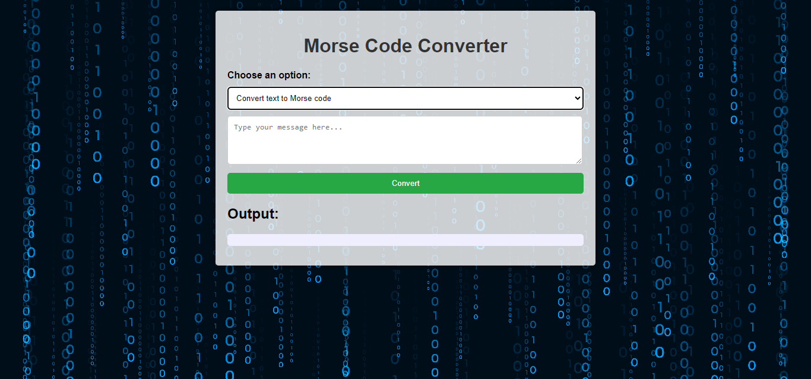

<h2 align="center">
  Morse_Code_Converter  
  <a href="https://morse-code-converter-beige.vercel.app/" target="_blank">Morse_Code_Converter</a>
</h2>

 

  

<h3 align="center">
    🔹
    <a href="https://github.com/kushal-s0/Morse-Code-Converter/issues">Report Bug</a> &nbsp; &nbsp;
    🔹
    <a href="https://github.com/kushal-s0/Morse-Code-Converter/issues">Request Feature</a>
</h3>

## TL;DR

You can fork this repo to modify and make changes of your own. Please give me proper credit by linking back to [kushal-s0](https://github.com/kushal-s0/Morse-Code-Converter). Thanks!

## Built With

My personal portfolio <a href="https://portfolio1-blue-zeta.vercel.app/" target="_blank">Kushal Soni</a> which features some of my github projects as well as my resume and technical skills. 

This project was built using these technologies.

- HTML
- Python
- CSS3
- Flask
- VsCode
- Vercel

## Features

**📖 Page Layout**

**🎨 Styled with Css with easy to customize colors**

**📱 Fully Responsive**

## Getting Started

Clone down this repository. You will need `Python` and `git` installed globally on your machine.

## 🛠 Installation and Setup Instructions

1. Installation: `pip install Flask`

2. In the project directory, you can run: `Python app.py`

Runs the app in the development mode.\
Open [http://localhost:5000](http://localhost:5000) to view it in the browser.
The page will reload if you make edits.

## Usage Instructions

Open the project folder and Navigate to `/templates and /static`.  
You will find all the components used and you can edit your information accordingly.

### Show your support

Give a ⭐ if you like this website!

